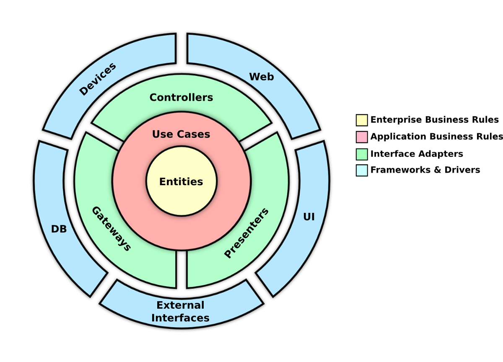

class: inverse, center, middle

# Architektúrák

---

class: inverse, center, middle

# Tematika

---

## Tematika

* Bevezetés az architektúra fogalmába
* Nem-funkcionális követelmények
* Kockázatkezelés
* Architektúrális tervezés eszközei
* Alkalmazások felépítése
* Gyakori alkalmazás architektúrák
* Architektúrák komponensei
* Gyakran felmerülő problémák és megoldásaik
* További alkalmazás architektúrák
* Tesztelhetőség
* Magas rendelkezésreállás, skálázhatóság
* Alkalmazásintegráció
* Modularizáció
* OO fogalmak

---

## Bevezetőül

* Nincsenek egzakt definíciók
* A legtöbb kijelentéssel vitába lehet szállni
* Áttekintő kép, fogalmak, referenciák átadása
* Javasolt saját jegyzet készítése

---

class: inverse, center, middle

# Architektúra fogalma

---

## Mi az az architektúra?

* Nincsenek egzakt definíciók
* Elosztott rendszerek megjelenésével
* Szoftverrendszer magasszintű struktúrája
* És ennek a dokumentálása
* Kommunikáció alapja
* Komponensek, komponensek közötti kapcsolatok, együttműködések
* Döntések és döntés okainak dokumentálása

---

## Architektúra

> "Mikor például az architektúrákról beszélünk, erről hajlamosak vagyunk 
> megfeledkezni: ahogy az épületek szerkezete sem csak azért van, hogy az egy 
> helyben álljon, hanem hogy emberek éljenek és dolgozzanak bennük, úgy a 
> szoftverarchitektúrák sem csak a technikai döntések halmazai, hanem 
> emberek együttműködésének színhelyei."

\- Kevlin Henney

---

## Architektúra által <br /> kiszolgált igények

* Nem funkcionális követelmények
	* Futtatókörnyezet
	* Teljesítmény
	* Üzemeltethetőség
	* Magas rendelkezésre állás, hibatűrés
	* Skálázhatóság, méretezhetőség

---

## Elosztott rendszerek

* Hálózat megjelenésével
* Rendszer komponensei különböző fizikai vagy virtuális számítógépeken
* Hálózattal összekötve, egymással üzenetekben kommunikálnak

---

## Tévhitek a hálózatról

* Megbízható
* Nincs késleltetés
* Végtelen sávszélesség
* Biztonságos
* Topológia nem változik
* Homogén
* Egy adminisztrátor van
* Nincs átviteli költség

---

## Elosztott rendszerek tulajdonságai

* Kiszolgálják az elvárt igényeket
  * Heterogén környezetben üzemeltethetőek
  * Nagy teljesítményűek
  * Üzemeltethetőek: monitorozás, megfigyelhetőség, események
  * Magas rendelkezésre állás, hibatűrés
  * Skálázhatóság, méretezhetőség 
* Összetettek
	* Nehezebb üzemeltethetőség
	* Nehezebb tesztelhetőség

---

## Ki az az architekt?

* Görög arkhitecton szó, arkhi (vezető), tekton (építész)
* Üzleti problémára technológiai megoldást ad
* Üzleti terület ismerete
* Technológiai ismeretek
* Management aspektusok
* Részvétel a teljes fejlesztési folyamatban
* Csapattag

---

## Component-based software engineering

* Dekompozíció - komponensekre bontás
* Separation of Concerns - külön feladat, külön komponens
* Single Responsibility - egy jól meghatározott feladat
* Loose coupling - laza kapcsolat
* Valamilyen környezetben futnak (pl. konténer)
* Környezet biztosítja az életciklusukat
* Környezet biztosítja a kapcsolatokat, ezáltal magukban való tesztelhetőségüket
* API-val rendelkeznek, IDL-lel (Interface Definition Language) írható le
* Különböző absztrakciós szinteken megfogalmazott komponensek


---

## Vízesés modell

* 60-as években dolgozták ki
* Lineáris módszertan
* Sorban végrehajtott fázisok
* Változáskezelés nehézkes
* Kisebb és jól definiált projektekhez

---

## UP

* Inkrementális és iteratív szoftver fejlesztési folyamat keretrendszer
* Személyre szabható
* Használati eset vezérelt
* Architektúra centrikus
* Megvalósítása: Rational Unified Process (RUP)

---

## UP fázisok


---

## Agilis szoftverfejlesztés

* Megrendelő igényei
* Követelmények változtatása akár késői szakaszban is
* Rövid iterációk
* Szoros együttműködés a megrendelő és fejlesztők között
* Motiválni kell a résztvevőket
* fejlesztési csapaton belül a beszélgetés a leghatékonyabb
  kommunikációs forma
* Előrehaladás mércéje a működő szoftver
* Elősegítik a fenntartható fejlődést
* Súly a technikai kiválóságon és jó tervezésen
* Egyszerűség
* Önszerveződő csapatok
* Fejlesztőcsapat önelemzése, továbbfejlődés a hatékonyság irányába

---

## Architektúra helye a módszertanban

* Már az elejétől
* Architektúra is változhat

---

## Modellezés

* Absztrakció: kiemeljük az adott szituációban fontos tulajdonságokat, és
  elvonatkoztatunk a többitől
* Modell alkotás több nézőpontból, pl. statikus és dinamikus modell

---

## UML

* Modellező nyelv
* Szabványos grafikus elemek
* UML modell
* Diagramok
** Strukturális diagramok
** Viselkedési diagramok

Ajánlott irodalom: Martin Fowler: UML Distilled

---

## 4+1 architectural <br /> view model

* Logical view: felhasználók számára nyújtott funkcionalitás (ábrázolható
  osztály-, kommunikáció- és szekvenciadiagrammal
* Development (implementation) view: fejlesztők számára hasznos (komponens-
  vagy csomagdiagram
* Process view: folyamatok, a rendszer dinamikus nézete (aktivitásdiagram)
* Physical (deployment) view: topológia, eszközök (deployment diagram)
* Scenarios: forgatókönyvek (használati eset diagramok)

---

## Funkcionális <br /> követelmények

* Mit kell csinálnia a rendszernek
* Rögzítése tipikusan használati esetekben

---

## Használati esetek

* Actor
    * Felhasználók
    * Külső rendszerek
* Rendszer határa
* Használati esetek
    * Scenario/story (agilis módszertanok elterjedésével, backlog elem lehet story is)

---

## Scenario/story

(Fowler style)

* Title
* Main actor
* Main success scenario: actor és a rendszer közötti együttműködés egyszerű leírása
    * Számozott lépésekkel
* Extensions: a main scenario-tól eltérő lefutások, elágazások

---

## WAVE próba

* Azt írja le, hogy mit kell csinálni, és nem azt, hogy hogyan?
* Az aktor nézőpontjából lett az eset leírva?
* Az eset hasznos-e az aktor számára?
* Teljes-e a használati eset?

---

## Scenario/story <br /> tulajdonságok

* Címek gyűjteménye a funkcionalitás gyűjteménye
* Alapja a priorizálásnak, becslésnek, tervezésnek, előrehaladás mérésének
* UML diagrammokkal kiegészíthető
* Ne tartalmazzanak a felhasználói felületre vonatkozó megkötéseket
* Javasolt kiegészítések
    * Elő- és utófeltételek
    * Jogosultságkezelés
    * Naplózás
    * Elfogadási kritériumok
    * Architektúrális kihatások

---

## Fogalomtár

* Segíti a használati esetek megírását
* Ubiquitous Language kialakítását (DDD)

---

## Rendszerterv

* Tipikus szintjei: logikai/fizikai rendszerterv
* Domain model megalkotása a követelmények alapján
* Formális reprenzentáció (tipikusan UML, vagy ER diagram)
* Logikai/fizikai közötti különbség: logikai nem tartalmaz implementációs részleteket
    * Pl. adatbázis specifikus típusok
* ER diagram alapján készül el az adatbázis séma
* UML osztálydiagram alapján az interfészek és oszályok
* Megközelítési módok
    * Forward engineering
    * Reverse engineering
    * Roundtrip engineering

---

## Nem-funkcionális <br /> követelmények

* Milyen legyen a rendszer

---

## Nem-funkcinális <br /> követelmények <br />  csoportosítása

* Use cases, operation
* Maintenance
* Development
* Deployment

---

## Minőségi követelmények 1.

* Performance: gyors kiszolgálás
* Availability: rendelkezésre állás, időnek hány százalékában
* Scalability: lehetőség a megnövekedett igény kiszolgálására
* Reliability: képesség az alkalmazás integritásának és konzisztenciájának
  megőrzésére (pl. mainframe kontra PC)
* Manageability: működés közbeni üzemeltethetőség
* Flexibility: változásokra történő érzékenység (pl. standard API-k
  elrejtik az implementációs különbségeket, driverek)
* Capacity: egységnyi idő alatt történő kiszolgálások
* Extensibility: funkcionális bővíthetőség

---

## Minőségi követelmények 2.

* Validity: az adott problémát oldja meg
* Reuseability: komponensek újra felhasználhatósága
* Security: biztonság
* Throughput: áteresztőképesség, művelet/idő
* Useability: felhasználók milyen könnyen veszik használatba
* Serviceability: hiba utáni helyreállítás vagy frissítés erőforrásigénye
* Testability: tesztelhetőség
* Realizatility: mennyi erőfeszítéssel lehet rendszerbe állítani
* Planability: mennyire tervezhető erőforrásilag
* Maintainability: tervezési hiányosság felfedezésének és javításának
  lehetősége
* Portability: különböző infrastruktúrára költöztetés lehetősége

---

## Nagyvállalati <br /> alkalmazással szemben támasztott követelmények

* Perzisztencia
* Többszálúság
* Tranzakció-kezelés
* Távoli elérés
* Névszolgáltatás
* Skálázhatóság
* Magas rendelkezésre állás
* Aszinkron üzenetkezelés
* Biztonság
* Monitorozás és beavatkozás

---

## Különbség az architektúra <br /> és rendszertervezés között

* Architektúra magasabb absztrakciós szinten
* Architektúra a rendszer/alrendszer szintig megy le
* Rendszertervezés komponens szintre megy le
* Architektúra főleg a NFR-ekre és riskekre ad választ
* Rendszertervezés a funkcionalitásra koncentrál

---

## Kockázatkezelés

* Kockázatok felismerése
* Kockázatok priorizálása
* Cost analysis
* Probléma bekövetkezésének valószínűsége
* Probléma megelőzésének költsége
* Probléma előfordulásakor keletkezett kár, elhárításának erőforrásigénye
* Felelősök kijelölése
* A "do nothing" is egy kezelési mód
* A kezelendő kockázatok közül a legbonyolultabbakat előre venni

---

## Tipikus kockázatok

* Erőforrás igényes területek
* Sok függőséggel rendelkező területek (core)
* Ismeretlen üzleti és technológiai területek
* Adott technológia ismert funkcionális és teljesítménybeli korlátai
* Legacy rendszerek
* Tranzakciókezelés
* Biztonság (GDPR)

---

## Architecture decision log

* Döntés: szoftver tervezési választás, mely egy követelményt elégít ki
* Döntések rögzítése
* Döntés környezete, felmerült kérdések, válasz, és következményei
* Döntések elnapolásának az elve (további információkhoz való hozzájutásáig nem napolható-e el)

---

## Irányelvek

* KISS
* YAGNI
* DRY

---

## Architektúra <br /> dokumentáció

* Alapja az architecture decision log
* Több diagramm, pl. component diagram
* Hossza ne legyen több, mint 4-5 A4 oldal

---

## Proof of concept <br /> (PoC) prototype

* Valamely döntés megvalósíthatóságának demonstrálására
* Validálható
* Eldobható prototípus (throw away)
* Továbbfejleszthető prototípus (evolutionary prototype - architecture
  baseline)
  * Funkcionális: tipikus használati esetek
  * Nem funkcionális
* Kicsi, nem teljes
* Koncentráljon a problémás esetekre

---

## Határok

* Mit nem tud a rendszer

---

class: inverse, center, middle

# Alkalmazás felépítése

---

## Absztrakciós szintek

* Alkalmazás
* Modul
* Unit: osztályok

---

## Use-reuse paradoxon


---

## Alkalmazás környezete

* Futtatókörnyezet (operációs rendszer, konténer)
* Adatbázis
* Más rendszerek

---

## Integráció más <br /> rendszerekkel

* Integráció háromfajta megközelítési mód
    * Bottom-up
    * Top-down
    * Meet-in-the-middle

---

## Frontend/backend

* Tipikusan böngészős, webes alkalmazások (vékony kliens)
* Frontend: HTML/CSS/JavaScript, backenddel aszinkron kommunikációval (AJAX), JSON formátummal, REST webszolgáltatásokkal
* Backend: üzleti logika, adattárolás

---

## Rétegelt architektúrák

* Rétegek
  * Felsőbb réteg csak az alatta lévő réteg szolgáltatásait használhatja
  * Csak a közvetlen alatta lévő réteg szolgáltatásait
  * API-n keresztül
* Rétegek
  * Perzisztens réteg
  * Üzleti logika réteg
  * Prezentációs réteg
  * Integrációs réteg

---

## Modul

* Újrafelhasználhatóság közbülső szintje
* Modulok meghatározása tipikusan a következők alapján
    * Üzleti funkciók
    * Rétegek
    
---

## Unit

* Osztályok és interfészek
* OOP fogalmak
* Clean code
* Refactoring

---

class: inverse, center, middle

# Adatbázis

---

## Adatbázis függetlenség

* Eltérő ügyféligények - különböző ügyfelek, különböző adatbázison akarják futtatni
* Tesztelésből adódó követelmények
* Standardok használata
    * Adatbázisspecifikus előnyök kihasználása
    * Nem írunk elágazásokat - interfész, különböző implementációkkal

---

## Adatbázis

* Adatok perzisztenciájára
* Struktúrált tárolás
* Megközelítési módok
    * Egyrétegű
    * Többrétegű (view/stored procedure réteg)
* Adatbázis fontossága
    
---

## Adatmozgatás adatbázis és alkalmazás között

* Adatok mozgatása az adatbázis és alkalmazás között erőforrásigényes
* Végezze az adatbázis azt, ami a feladata
    * Join
    * Aggregálás

---

## Megszorítások

* Adatintegritás
* Véd az alkalmazás programozói hibáitól

---

## Connection pool

* Adatbázissal való kapcsolatfelvétel erőforrásigényes
* Módosított adatbázis objektumok, validation query

---

## Idősorok

* Kezelése relációs adatbázisban körülményes
* Harmadik dimenzió bevezetése
* Mérlegelendő:
    * Egy tábla, több tábla
    * Plusz mezők, érvényesség, indexelés
    * Szülő-gyermek táblák esetén

---

## Auditálás

* Ki és mikor módosította
* Miről mire
* Adatbázis szinten? (Trigger)

---

## Fa ábrázolása <br /> adatbázisban

* Relációs algebra nem alkalmas rá
* Adatbázisfüggő megközelítések
* Nested tree
    * Lekérdezéskor gyors
    * Módosításkor erőforrásigényes
    
---
    
## Nested tree
    


---

## Fájltárolás

* Tranzakciókezelés
* Mentés
* Alternatív megoldás: fájlrendszer
    * Hash/könyvtárstruktúra
* Mérés!
* Célmegoldás

---

## Adatbázis séma verziózás

* Adatbázis séma létrehozása (táblák, stb.)
* Változások megadása
* Metadata table alapján

---

## Elvárások

* SQL/XML leírás
* Platform függetlenség
* Lightweight
* Visszaállás korábbi verzióra
* Indítás paranccssorból, alkalmazásból
* Cluster támogatás
* Placeholder támogatás
* Modularizáció
* Több séma támogatása

---

## NoSQL adatbázisok

* Kulcs-érték adatbázisok
* Sok oszloppal rendelkező, új oszlopokkal bővíthető adatbázisok
* Dokumentum alapú adatbázisok
* Gráf alapú adatbázisok

---
        
## NoSQL adatbázisok <br /> megjelenése
   
* Specializált feladatok
* Elosztott működés
* CAP tétel: egy-egy konkrét elosztott rendszer a három alapvető képesség közül (konzisztencia, rendelkezésre állás, particionálás-tűrés) legfeljebb kettőt tud megvalósítani.
    * Konzisztencia: ellentmondásmentesség
    * Rendelkezésre állás: elérhetőség a kliensek számára
    * Particionálás-tűrés: hálózat szétesés tűrése, helyreállás

---

class: inverse, center, middle

# Frontend és backend

---

## Módszertani vonatkozások

* Full-stack developer?

---

## HTTP(S) protokoll

* 1999-ben kiadott RFC 2616 definiálja a HTTP/1.1-et (W3C szervezet)
* 2015-ben leváltott a HTTP/2.0-ás verzió, amit az RFC 7540 definiál
* URI
* Kliens-szerver kommunikáció
* Kliens tipikusan böngésző
* Kérés-válasz alapú protokoll
* Szöveges
* Fájlátvitel: multipart request
* Fejléc (kulcs-érték párokkal), törzs
* Állapotmentes
* (S): secure - TLS alapú titkosítás
* Elterjedt, minden platform ismeri

---

## HTTP protokoll jellemzők

* HTTP metódusok
    * GET/POST között választás
    * Idempotencia
* Redirect after post
* Státuszkód
* Mime-type, content-type
* Cache
* Cookie
* Session

---

## HTTP cache mechanizmusok

* `Cache-Control` http fejléc
* `ETag` http fejléc
* Változott erőforrás más címen publikálása

---

##  `Cache-Control` http fejléc

* `max-age` érték, meddig tárolható lokálisan
* `no-store` nem cache-elhető tartalom
* `no-cache` cache-elheti, de minden esetben kérdezze meg a böngészőt, hogy van-e újabb
* `private` közbülső eszközök, pl. proxy nem cache-elheti

---

## ETag

* `ETag` header a válaszban, mely egy azonosítót rendel az erőforráshoz
* Böngésző `If-none-match` headerben elküldi a nála tárolt resource verziószámát
* Szerver vagy `304 Not Modified` státuszt küld vissza, vagy a kért erőforrást

---

## Változott erőforrás <br /> címének módosítása

* Az erőforrások címében változó tartalom
  * Pl. az alkalmazás verziószáma (pl. Git hash)
* Az erőforrásokra hivatkozásnál ezt fel kell oldani

---

## Autentikációs <br /> mechanizmusok

* BASIC
* Tanúsítvány alapú
* OAuth (SSO, token alapú megvalósítás)
* JWT

---

## AJAX

* Asynchronous JavaScript and XML
* Technológia a HTML dokumentum (DOM fa) módosítására, lap váltása nélkül,
  szerver oldali adatok alapján
* Megnövelt felhasználói élmény
* Kisebb adatforgalom, csökkenő szerver terhelés
* XML helyett már JSON
* Aszinkron: callback akkor hívódik meg, ha megérkezett a válasz a szervertől

---

## SPA
        
* Single-page application
* Kihívások
  * Kezdeti betöltődés
        * Keresőoptimalizáció
        * History
        * Analitika

---

## Szerver indította kapcsolatfelvétel

* HTTP szabvány nem biztosít erre megoldást
* Polling
* WebSockets
* Server-sent events

---

## WebSocket

* Pehelysúlyú kommunikációs protokoll a TCP/IP felett
* Full-duplex
* HTTP Upgrade header HTTP protokollról WebSocketre váltásra, ugyanazon porton
* Kapcsolatfelvételt a kliens kezdeményezi, de utána kétirányú

---

## SockJS

* WebSocket emuláció
* Ha nem működik a WebSocket, pl. régi böngésző, vagy a proxy nem támogatja
* Szükség esetén visszavált alternatív protokollra, az API a WebSocket API marad (polling)

---

## STOMP

* Simple (or Streaming) Text Oriented Message Protocol
* MOM-okhoz való kapcsolódáshoz
* Nagyon hasonló a HTTP protokollhoz
* Frame-ekből áll
* Fejléc (kulcs-érték párok), törzs
* Parancsok, pl. `CONNECT`, `SEND`, `SUBSCRIBE`, stb.


---

## Server-Send Events (SSE)

* WebSocketnél egyszerűbb kommunikáció
* Szerver által küldött üzenetek
* Nyitott HTTP kapcsolat streamelve (Mime-type: `text/event-stream`)
* Formátuma:

```
event:message
:Employee has created
id:253c3eb8-fb59-410c-82b9-d2acfa89a5d5
retry:10000
data:{"content":"Employee has created: John Doe"}
```

---

## HTTP/2 Server Push

* Erőforrások leküldése, mielőtt a kliens kérné
* Sávszélesség hatékonyabb kihasználása
* Nem kell külön kérés/válasz az erőforrásoknak

---

## RESTful webszolgáltatás

* Roy Fielding: Architectural Styles and the Design of Network-based Software Architectures, 2000
* Representational state transfer
* Egyedileg címezhető erőforrások (resource)
* Uniform, constrained interface for manipulate resources (crud)
* Létező technológiák: URI, HTTP, XML, JSON
* Web Application Description Language (WADL) – nem elterjedt
* AJAX világ segítette az elterjedését

---

## HATEOAS

* Hypermedia as the Engine of Application State
* Önleíró API
* Kapcsolódó erőforrásokra linkek
* [Hypertext Application Language](https://en.wikipedia.org/wiki/Hypertext_Application_Language)
            
```javascript
{
  "_links": {
    "self": {
      "href": "http://localhost/api/employees/1"
    }
  },
  "id": "1",
  "name": "John Doe"
}
```

---

## CORS

* Cross-origin resource sharing (CORS)
* Lehetővé teszi a hívást más domainről letöltött JavaScriptből
* Böngészők lehetővé teszik bizonyos erőforrások (kép, css, stb.) elérését más
  domainről letöltött tartalomból
* Biztonsági okokból azonban JavaScript AJAX hívást nem engedélyezik
    * Same-origin security policy
* CORS egy mechanizmus arra, hogy (akár bizonyos megkötésekkel) engedélyezni lehessen
* HTTP headerekkel, böngésző oldali támogatás
                
---

## CORS működése

* Egyszerű eset
  * Amikor nincs írás
  * `GET` metódus esetén vagy `POST` esetén bizonos MIME type-nál
  * A böngésző `Origin` headerben küldi a hivatkozó dokumentum forrásának domainjét
  * A szerver `Access-Control-Allow-Origin` headerben jelzi, honnan megengedett
* Preflight eset
  * A böngésző küld egy plusz megelőző kérést `OPTIONS` metódussal
  * Ha a böngésző válaszában a `Access-Control-Allow-Origin` header megfelelő
  * Újabb, valós kérés

---

## Header-ök

* Kérés
    * `Origin` - hivatkozó dokumentum forrásának domainje
    * `Access-Control-Request-Method` - Küldeni kívánt kérés metódusa
    * `Access-Control-Request-Headers` - Küldeni kívánt kérés fejlécei
* Válasz
    * `Access-Control-Allow-Origin` - engedélyezett domainek (`*` wildcard megengedett)
    * `Access-Control-Allow-Credentials` - `Cookie` küldése megengedett-e
    * `Access-Control-Expose-Headers` - Válasz headerből mi olvasható a kliensnek
    * `Access-Control-Max-Age` - Preflight kérésre érkezett válasz meddig cache-elhető
    * `Access-Control-Allow-Methods` - engedélyezett metódusok
    * `Access-Control-Allow-Headers` - engedélyezett header

---

## Iránymutatások REST API tervezésekor

* Verziókezelés
* Egységes validáció
* Egységes hibakezelés
* Egységes lapozás

---

class: inverse, center, middle

# Frontend architektúrák

---

## Külön stack

* HTML/CSS/JavaScript
    * Tartalom/forma/működés
* További keretrendszerek
    * Angular
    * React
    * Vue.js
* CSS keretrendszer
* CSS extenson
* Build eszköz
* Kódminőség ellenőrzés
* Unit teszt keretrendszer (+ mock)

---

## MV* architektúrák

* MVC (Model View Controller)
* MVP (Model View Presenter)
* MVVM (Model View View Model) - two-way binding

---

## MV* architektúrák


---

## MV* architektúrák <br /> jellemzői


---

## UI guideline

* Támogatott felbontás
* Színek, padding, border, betűtípusok, ikonkészlet
* Komponensek: megjelenítésre és adatbevitelre
* Visszajelzés sikeres művelet esetén
* Validációs hibák, hibaüzenetek
* Dátumformátum
* Táblázatok: lapozás (stream), táblázat fejléc igazítás, igazítás (számok jobbra, dátumok középre)
* Billentyűzettel való kezelhetőség
* Reszponzivitás
* Gesztusok
* Iteratívan fejlődő

---

## UI teszt checklist

* Alapja a UI guideline

---

class: inverse, center, middle

# Rétegelt architektúrák

---

## Perzisztens réteg

* Akár az adatbázis, akár az adatbáziselérési réteg lecserélését lehetővé teszi
* DAO
* SQL
* ORM (Object-relation mapping)
    * Már létező adatbázis
    * Öröklődés
    * Lazy betöltés
* Egymás mellett használható

---

## Üzleti logika réteg

* Megfelelő absztrakciós szint kiválasztása
* BPMN
* Unit tesztelésnek a legnagyobb szerepe

---

## Prezentációs réteg

* Tipikusan REST végpontok
* JSON binding
    * Kétirányú referencia
    
---

## Integrációs réteg

* Nem érdemes az üzleti réteget kiforgatni
* Gateway réteg
* Különböző verziók
* Üzleti logika réteg refactorálható

---

## Keretrendszer kontra <br /> 3rd party library

* Keretrendszer hívja a komponenseket
* 3rd party library-t csak mi hívunk
* Többféleképpen felhasználhatóak, definiálni kell, hogyan

---

## Keretrendszer

* Dependency Injection, Inversion of Control
* Komponensek életciklusát és kapcsolatait kezeli
* Fajtái
    * Non-invasive
    * Invasive
    
---

## 3rd party library

* Interfész mögé elrejteni, ezáltal cserélhetővé válik

---

## Kiválasztásának <br /> kritériumai

* Hype faktor
* Aktivitás (hírek, fórum, levelezési lista, StackOverflow)
* Tesztelhetőség
* Dokumentáció
* Forráskód, tesztlefedettség
* PoC

---

## Horizontális <br /> szolgáltatások

* Az alkalmazás több pontján megjelenő funkcionalitás (un. cross-cutting concern)
* Biztonság
* Naplózás
* Tranzakciókezelés

---

## AOP terminológia

* Advice: maga a funkcionalitás, amit el kell végezni
* Join point: az alkalmazás azon pontjai, ahol az advice-t be lehet illeszteni
* Pointcut: azon kiválasztott join pointok, ahol az adott advice-t le kell futtatni
* Aspect: advice és pointcut összessége

---

## Rétegelt architektúra megvalósítása .NET esetén

* Perzisztens réteg: Data Access Layer, Entity Framework
    * Domain Objects
* Business Layer - Managers
* Service layer ASP.NET Web API - Controllers

---

## Common/util csomag, <br /> modul, osztályok

* Kerüljük a használatát
* God object
* Nem objektumorientált
* Saját keretrendszer kialakulásának veszélye

---

## Párhuzamosság

* Hagyjuk a keretrendszerre
* Magas szintű eszközök
* Funkcionális, reaktív programozás

---

## Konvertálások

* Entitás kiengedése prezentációs rétegbe?
* DTO tervezési minta
  * Csak a szükséges adat utazik (biztonság fejlesztői hiba ellen)
  * Azonnal látható, hogy az adott metódus melyik funkcionalitáshoz tartozik
* Mapping library használata
* Hol vannak a határok?

---

## Lapozás, rendezés <br /> támogatása

* Egész perzisztens rétegből indulva
* Végig kell vinni a teljes stacken
* URL paraméterek
    * Lap mérete, aktuális lap száma, rendezés mi alapján (többszörös), ASC/DESC
* JSON válasz wrapper
    * Összes elem száma, összes lap száma
    * Aktuális lap, következő, előző van-e
* Összeköthető HATEOS-sal
* JavaScript komponens felkészíthető a kezelésére
* JOIN esetén vigyázni (trükk: először csak a szülő táblára lekérdezés, majd a következő lekérdezésben `in` az elsődleges kulcsra)

---

## Validáció

* Melyik rétegben?
  * Frontend/backend
  * Backenden belül melyik rétegben?
* Formai ellenőrzések
* Üzleti ellenőrzések
* Használata kivételkezeléssel
* Átforgatása REST válasszá

---

## Hibakezelés

* Lokális hibakezelés
* Globális hibakezelés
* Átforgatása REST válasszá

---

## Tranzakciókezelés


---

## ACID tulajdonságok

* Atomicity: a tranzakcióban futó műveletek mindegyik lefut, vagy egy sem
* Consistency: konzisztens állapotból konzisztens állapotba juttatja az adatbázist
* Isolation: a párhuzamosan futó tranzakciók egymás működést nem befolyásolják
* Durability: a tranzakció eredménye tartósan (perzisztensen) tárolásra kerül

---

## Izoláció

* Izolációs problémák:
    * dirty read
    * non-repetable read
    * phantom read
* Izolációs szintek:
    * read uncommitted
    * read commited
    * repeatable read
    * serializable

---

## Tranzakciókezelés

* Propagációs szabályok
* Visszagörgetési szabályok
* Timeout
* Melyik rétegben, mi alapján?
* Minimalizálni a nyitott tranzakció hosszát
* Tipikusan AOP-val

---

## Locking

* Nincs locking
* Optimistic locking (verziószámmal, verziószám eltérés esetén programozottan kezelendő)
* Pessimistic locking (adatbázis lock - bottleneck lehet)

---

## Elosztott tranzakciók

* Tranzakció koordinátor
* Erőforrás menedzserek
* 2PC, XOpen/XA

---

## Cache-elés

* Más forrásból érkezik adat (pl. külső adatbázis update)
* Objektumok memóriában megőrzése
* Nem kell újra lekérni, pl. adatbázisból, hálózatról
* Kulcs, érték párok
* Evict
* Cache perzisztencia (többrétegű)
  * Szerializálhatóság
* Cache listener
* Statisztika

---

## Elosztott cache

* Szerializálhatóság
* Platformfüggetlenség

---

## Eseménykezelés <br /> alkalmazáson belül

* Megvalósítja a laza kapcsolatot
* Akár modulokon keresztül
* Üzleti logika rétegből a prezentációs réteg felé
    * Együtt alkalmazható a WebSocket vagy SSE technológiákkal
* Döntés
    * Szinkron
    * Aszinkron
* Hibakezelés
* Observer

---

## Autentikáció és <br /> authorizáció

* Felhasználó és szerepkör összerendelés
* Csoportok kezelése
* Erőforrásokhoz való hozzáférés (URL szinten)
* Metódusokhoz való hozzáférés
* Programozott lekérdezés
* Tipikusan AOP-val

---

## ACL

* Access Controll List
* Entitáshoz való hozzáférés
* Felhasználó/szerepkör/csoport - entitás (id) - művelet összerendelés
* Művelet bővíthetőség
* Nem tartalmaz közvetlen referenciát az üzleti entitásra, csak annak azonosítójára

---

## Állapot

* Kérések között a memóriában tárolt objektumok
* Session
* Helyette elosztott cache, adatbázis
* Megnehezítik a skálázhatóságot
* Törekedjünk állapotmentességre
    * Pl. authentication esetén JWT
    
---

## Auditálás

* Végezheti az adatbázis
* Végezheti az alkalmazás
* Menthető nem csak az entitások, hanem a módosítást előidéző műveletek is

---

## Naplózás

* Különböző szintek
    * Nincs explicit definíció
* Hierarchiába rendezetten
* Konfigurálható: konzolra, fájlba, stb.
* Konfigurálható formátum
* Naplózás szintje akár futás időben is állítható legyen
* Ne lassítsa az alkalmazást
    * Paraméterkiértékelés (pl. XML/JSON szerializáció)

---

## Ütemezés

* Perzisztencia adatbázisban
* Elosztott tranzakciókezelés
* Clustering (failover, load balancing)
* Naptárkezelés, szabadnapok
* Job listener komplex workflow létrehozására
* Plugins, pl. history-ra
* Prioritás állítása

---

## Batch folyamatok

* Ütemezéssel kombinálva
* Folyamatok lépésekből állnak
* Tranzakciókezelés
* Logging/tracing
* Monitorozási lehetőség, statisztika
* Start/stop/restart
* Retry/skip
* Egymásra futás kezelése
* Clusterezés
* Partícionálás

---

## Időzónák kezelése

* Egy időzóna: annak a használata
* Több időzóna: UTC szerinti kezelés, felhasználói felületen konvertálás a cél időzónára

---

## Szabad szöveges keresés

* Adatbázis támogatás
* Elasticsearch
* Apache Solr (NoSQL)

---

## Konfigurációkezelés

* Fájlban vagy adatbázisban (felületen megjelenő)
* Üzleti vagy technológiai
* Convention over configuration, intelligent default values

---

class: inverse, center, middle

# Magas rendelkezésreállás, skálázhatóság

---

## Magas rendelkezésre állás

* High availability (HA)
* Lehetővé teszi a rendszer a megállapodáson alapuló, átlagon felüli (tipikusan időben mért) használhatóságát
* Időbeli, pl. *öt kilences*, az év 99,999%-ában rendelkezésre áll, 5,26 perc, havonta 25,9 másodperc
* Megállapodás
    * Service Level Agreement (SLA)
* Rendszer rendelkezésre állása egyenlő a komponensek rendelkezésre állásának a szorzatával
* Felkészülés a váratlanra

---

## Megvalósíthatósága

* A rendszerben ne legyen single point of failure
* Redundancia: ugyanazt a funkciót több elem látja el
    * Szükség van egy forgalomirányítóra - melynek szintén magas rendelkezésre állásúnak kell lennie
* Hiba azonnali detektálása

---

## Skálázhatóság

* Scalability
* Növekvő terhelés kiszolgálása, az alkalmazás módosítása nélkül
*       Terhelés növekedésének és a állandó performancia biztosításának költségének a hányada

---

## Skálázhatóság fajtái

* Vertikális skálázhatóság: további CPU-k, memória, diszk
* Horizontális skálázhatóság: további számítógépek

---

## Load balancer

* Forgalomirányító, redundáns rendszerek és horizontális skálázhatóság esetén
* Algoritmusok
    * Round robin
    * Response time, first available
    * Least loaded
    * Weighted
    * Own implementation
        
---

## Állapot

* Legegyszerűbb megoldás: állapotmentesség
* Állapot, de nem kerül replikálásra: sticky session
* Állapotreplikáció: cluster

---

class: inverse, center, middle

# Twelve factor app, cloud native

---

## Twelve-factor app

* [Twelve-factor app](https://12factor.net/) egy manifesztó, metodológia felhőbe telepíthető alkalmazások fejlesztésére
* Heroku platform fejlesztőinek ajánlása
* Előtérben a cloud, PaaS, continuous deployment

---

## Cloud native

* Jelző olyan szervezetekre, melyek képesek az automatizálás előnyeit kihasználva gyorsabban megbízható és skálázható alkalmazásokat szállítani
* Pivotal, többek között a Spring mögött álló cég
* Előtérben a continuous delivery, DevOps, microservices

---

## Verziókezelés

* Egy alkalmazás, egy repository
* A többi függőségként definiálandó
* Modularizált fejlesztésnél tűnhet ez jó ötletnek a modulokat külön repository-ban tartani
* A különböző környezetekre telepített példányoknál alapvető igény, hogy tudjuk, hogy mely verzióból készült (felületen, logban látható legyen)

---

## Függőségek

* Az alkalmazás nem függhet az őt futtató környezetre telepített semmilyen csomagtól
* Függőségeket explicit deklarálni kell
* Nem a függőségek közé soroljuk a háttérszolgáltatásokat, mint pl. adatbázis, mail szerver, cache szerver, stb.

---

## Konfiguráció

* Környezetenként eltérő beállítások
* Konfigurációs paraméterek a környezet részét képezzék
* Kerüljük az alkalmazásban a környezetek nevesítését
* Környezeti változókban

---

## Háttérszolgáltatások

* Adatbázis (akár relációs, akár NoSQL), üzenetküldő middleware-ek, directory és email szerverek, elosztott cache, Big Data eszközök, stb.
* Automatizált telepítés
* Infrastructure as Code, Ansible, Chef, Puppet
* Eléréseik környezeti paraméterként publikálódnak az alkalmazás felé
* Fájlrendszer nem tekinthető megfelelő háttérszolgáltatásnak
* Beágyazható háttérszolgáltatások
* Autentikáció - konfiguráció

---

## Build, release, futtatás

* Futtatható alkalmazás készítése
* Kezeli a függőségeket
* Futtatható alkalmazást kombinálja a környezeti konfigurációval
* Eredménye a release, egyedi azonosítóval
* Visszaállás egy előző release-re
* Build, release, futtatás élesen elválik
* Continuous Delivery
    * Pipeline
    * Ugyanazt a binárist kell végigvinni
 * Docker
     
---

## Folyamatok

* Alkalmazás egy vagy több folyamatként futtatható
* Állapotmentesség
* Shared nothing 
* Minden esetben háttérszolgáltatás használata

---

## Port binding

* Konfigurálható legyen a port, ahol elindul

---

## Konkurrencia

* Különböző típusú folyamatok különválasztása, folyamatvezérlővel felügyelni
* Típusai
    * Web alkalmazások: sok rövid párhuzamos kérést
    * Kevésbé kritikus válaszidő: képekhez bélyegkép generálás, 
    PDF dokumentumok generálása, hírlevelek kiküldése, számlák generálása, elszámoló batch folyamatok

---

## Disposability

* Nagyon gyorsan induljanak
* Graceful shutdown
* Batch folyamatoknál: megszakíthatóvá, újraindíthatóvá (reentrant)
    * Tranzakciókezeléssel
    * Idempotencia
    
---

## Éles és fejlesztői <br /> környezet hasonlósága

* Különbségek
    * Időbeli eltolódás (lassú release)
    * Személyi különbségek (fejlesztő nem lát rá az éles rendszerre)
    * Eszközbeli különbségek
* Continuous Delivery, DevOps, Docker

---

## Naplózás

* Nem az alkalmazás feladata a napló irányítása a megfelelő helyre, vagy a napló tárolása, kezelése, archiválása, görgetése, stb.
* Írjon konzolra
* ELK, Splunk

---

## Felügyeleti folyamatok

* Felügyeleti, üzemeltetési folyamatok
    * Pl. adatbázis séma migráció
* Ne ad-hoc szkriptek
* Alkalmazással együtt kerüljenek verziókezelésre, buildelésre és kiadásra
* Preferálja a REPL (read–eval–print loop) használatát
    * Tipikusan command line
    
---

class: inverse, center, middle

# További architektúrális minták

---

## Hexagonal Architecture (aka Ports and Adapters)


---

## Hexagonal Architecture 

* Nem kell hatszögnek lennie, csak így van elég hely
* Alkalmazás lazán kapcsolódó komponensek:  application core, adatbázis, felhasználói felület, teszt szkriptek, interfészek más rendszerekkel
* Egy komponens egy másikhoz több porton kapcsolódhat
* Egy porton egy protokollon keresztül lehet kapcsolódni (API)
* Tipikusan portok:
    * Event sources (user interface, automatic feeding)
    * Notifications (outgoing notifications)
    * Adatbázis
    * Adminisztráció
* Adapterek kapcsolat a komponensek és a világ között
* Egy porton több adapter is lehet
* Adapterek interfész implementációk

---

## Onion architecture

* Interfészek bevezetése
* 
* Application core-t is több koncentrikus körre osztja, inversion of control használatával

---

## Jellemzők

* Separation of concerns
* Keretrendszerektől független
* Tesztelhető
* UI-tól független
* Adatbázistól független
* Független a külső, kapcsolódó rendszerektől

---

## Clean architecture



---

## Clean architecture

* Forráskód függőség csak kívülről befelé
* Egyszerű adatstruktúrák utaznak csak a határokon át
* Dependency inversion principle: függőség az interfészre, csak deklarálja a függőségeket

---

## Microservices

* Architectural style
  * Small services (two american size pizza team)
  * Own process
  * Lightweight communication (szinkron/aszinkron)
  * Business domain
  * Independently deployable
  
---

## Előfeltételei

* DevOps
* Self-service, on-demand, elastic infrastructure
* Infrastructure as code (immutable image)
* Continuous integration and delivery
* Tesztelés élesben (blue/green deployment, canary deployment)

---

## Principles/characteristics

* Deployment independence
* Business capabilities
* Product, not project
* API focused
* Smart endpoints
* Decentralized governance (csapat az eszközökről önállóan dönthet)
* Decentralized data management
* Infrastructure automation
* Design for failure
* Evolutionary design

---

## Kapcsolódó területek

* DDD
* Feature toggles
* A/B testing
* CQRS/event sourcing
* Advanced service coreography

---

## DDD

* Projekt elsődleges fókusza a fő domain
* Technológiai szakértők, és a terület szakemberei közötti együttműködés
* Konceptuális modell 
* Ubiquitous Language
* Domain Model: komplex üzleti tudást/ismereteket rendszerezze
    * Elsődleges megjelenési formája a forráskód
    * Folyamatosan változik
    
---

## DDD építőkockák

* Entitások: saját identitása, életciklusa
* Value object: csak egy érték, immutable
* Service: entitásokon átnyúló műveletek koordinálása, állapotmentes, belépési pont a domain modelbe
* Repository: magába zárja és elrejti az adatbázis hozzáférést
* Aggregates
* Factories

---

class: inverse, center, middle

# Tesztelhetőség

---

## Tesztpiramis


* Unit tesztek: adott programozási nyelv legkisebb részeit tesztelik
* Integrációs tesztek: csoportba szervezett egységek tesztelése, nem nyúlik át másik rendszerekbe
* E2E: szoftverrendszer tesztelése adott környezetben, külső függőségeivel integrálva, funkciók, folyamatok tesztelése az elejétől a végéig

---

## Test harness helye

* A test harness az architektúra része!
* Az architektúra külső körén helyezkedik el
* A tesztesetek függnek a kódtól, a kód nem függ a tesztesettől
* Alkalmazástól külön telepíthető, de telepítendő
* Része a rendszer tervezésének
* Tehetünk-e production kódba tesztelést támogató részeket?

---

## Unit tesztelés ígéretei

* Hibák mielőbbi megtalálása, ezáltal költségcsökkentés
* Refactoring támogatása
* Komplex rendszer esetén hamarabb találjuk meg a hibás komponenst
* Komponensek közötti interakció és függőségek mielőbbi átgondolása
* Tiszta API, lazán kapcsolt kód

---

## Unit tesztelés <br /> megközelítései

* Állapot alapú: a megfelelő bemenetre az elvárt kimenetet kapjuk eredményül (sociable)
* Viselkedés alapú: a megfelelő osztályokkal a megfelelő módon működött együtt: mockolás (solitary)

---

## Unit tesztelés árnyoldalai

* Rettentő finom granuláltság, amennyiben átszervezünk, sok tesztesetet érint
   * Akadályozza a magasabb szintű refactoringot
   * Implementációs részleteket tesztel

---

## Integrációs tesztelés

* Legkisebb munkával legnagyobb lefedettség
* Engedi a refactoringot, API maradjon változatlan
* Ellenőrizhetőek a 3rd party library-k helyes használata (Spring MVC, JSON mapping, Bean Validation, bean konvertálás, JPA mapping, lekérdezések)
* Nem olyan lassú a futtatása
* Még nem jön be a más rendszerekkel való integráció problémája

---

## Tesztpostairón


* Testing honeycomb (Spotify)

---

## Integrációs tesztelés <br /> small unit groups


---

## Gateway mockolás

* Szimulálható a rossz válasz is
* Szimulálható a késleltetés is

---

## Integrációs tesztelés <br /> repo/gateway mock


---

## Integrációs tesztelés <br /> memórián belül


---

## Integrációs tesztelés <br /> memórián kívül


---

## Contract testing

* Inkompatibilis API módosítás csak integrációkor derül ki
* Szolgáltatás hívója rögzíti, hogyan hívja a szolgáltatást
    * Szolgáltatás tesztesetei közé kéne bekötni - pull request - meg tudom írni?
    * Testing by example
    * Ha visszafele nem kompatibilisan módosít - elbukik a teszt
* Spring Cloud Contract
    * Leírjuk a kommunikációt (milyen kérésnél milyen válaszra várunk) és mindkét oldalon tesztesetként jelenik meg
    * Hívott oldalon egy REST-Assured tesztesetet generál
    * Hívó oldalon egy WireMock-ot


---

## E2E ígéretei

* Rendszer teszelése a felhasználó szemszögéből
* Teljes üzleti folyamatok tesztelése
* Rendszer tesztelése a környezetével integrálva

---

## Kételyek az E2E <br /> teszteléssel kapcsolatban

* Teszt környezetben elérhetőek a kapcsolódó rendszerek? Olyan állapotban vannak, hogy támogatják a tesztelést?
* Ne függj törékeny, gyakran változó dolgoktól, mint a GUI
    * Fragile Test Problem - változik a GUI, változtatni kell a teszteseteket
* Magas teszteset karbantartási költség
* Magas test harness üzemeltetési költség (böngészők - (virtuális) felület)
* Microservice környezetben magas microservice üzemeltetési költség
    * Konténer technológia, konténer orchestration nélkül megoldhatatlan
* Lassú

---

## E2E konklúzió

* Kevés teljes folyamaton átívelő, több lépésből álló E2E
teszt, ami a core üzleti funkcionalitást teszteli (happy path), (sanity)
* Üzletileg fontos (bevétel, kötbér)
* Tesztelés élesben
    * Blue/Green - átkapcsolás tesztelt, párhuzamos környezetre (teszt adatok élesben)
    * Canary release - folyamatos átterhelés
    * Feltételei: monitorozás, visszaállás

---

class: inverse, center, middle

# Integráció más rendszerekkel

---

## SOAP over HTTP(S) webszolgáltatások

* HTTP(S) átviteli protokoll
* SOAP boríték (XML alapú)
* WSDL interfészleíró (XML alapú)

---

## Problémák elosztott rendszerek esetén

* Hívott fél megbízhatatlan
* Kommunikációs csatorna megbízhatatlan
* Hívott fél lassan válaszol
* Terheléselosztás
* Heterogén rendszerek

---

## Aszinkron üzenetküldés

* Message oriented middleware
    * Köztes szoftverréteg üzenetek megbízható továbbítására
    * Bonyolult funkcionalitást elrejt egy egységes API mögé
        * Jelen esetben hibakezelés
    * Store and forward

---

## Aszinkron üzenetküldés modellek

* Point to point
* Publish and subscribe

---

## MOM tulajdonságok

* Üzenet fejléc és törzs
* Fejléc: kulcs-érték párok, üzenetszűrésre és forgalomirányításra
* Browse
* Mérgezett üzenet
* Kérés-válasz üzenet
    * Végleges és ideiglenes sorok létrehozása
* Message Persistence
* Prioritás
* Message Expiration és Delivery Delay
* Durable subscription
* Shared subscription

---

## SOA

* Lazán kapcsolt, újrafelhasználható szolgáltatások
* Service contract, interfész ismert, implementáció rejtett
* Üzenet orientált
* SOAP, WSDL technológiákon alapuló

---

## Topológiák

* Pont-pont
* Hub and spoke
* Bus

---

## ESB

* Szinkron és aszinkron támogatás
* Route-olás
* Protokoll adapterek
* Üzenet transzformáció
* Üzenet enrichment
* QoS (security (encryption and signing), reliable delivery, transaction management )
* Management

---

## További SOA komponensek

* Üzleti folyamatok, orchestration, BPEL
* Üzleti szabályok, rule engine


---

class: inverse, center, middle

# Modularizáció

---

## Modularizáció

* Az interfészek, osztályok egy finom szemcsézettséget adnak
  * Használhatóságuk nehézsége magas
  * Újrafelhasználhatóak
  * Kevesebb a függőségük
* SOA szerinti szolgáltatások durva szemcsézettségűek
  * Használatuk viszonylag egyszerű
  * Kevésbé újrafelhasználhatóak
  * Sok függőség

---

## Állítások

* Növeljük az újrafelhasználhatóságot, úgy lesz nehezebb használni
* Flexibilitással nő a komplexitás

---

## Modul fogalma

* Deployable (külön telepíthető)
* Manageable (külön indítható, leállítható)
* Natively reusable (metódushívással)
* Composable (több modulból egy modul hozható létre)
* Stateless unit (nem példányosítható, egy verzióból egy és csakis egy létezik)
* Concise interface (tömör interfész a használói számára)

---

## Modularizációs minták

* Lsd. MindMap

---

class: inverse, center, middle

# Architektúrák

---

## OO

* OOAD - object oriented analysis and design
* Szoftverkrízisre adott válasz
* Program egységek és köztük lévő kapcsolatok
* Emberi gondolkodásmód kiterjesztése
* Imperatív megközelítés

---

## OO háttér

* Négy oo alapelv: *A-PIE* (Abstraction, Polymorphism, Inheritance, Encapsulation)
* Objektumorientált alapelvek, high cohesion, low coupling
* Single responsibility, legkisebb felelősségi kör
* Együtt változó részek egységbe zárása, külön változó részek elválasztása
* Programozzunk interfészekkel
* Delegálás

---

## Kompozíció használata az öröklődés helyett

* Plusz viselkedés bevezetésére
* Az öröklődés statikus, futás időben nem cserélhető
* Több programozási nyelven az öröklődés egyszeres
* Kompozíció, és főleg interfészek használatával cserélhető
* Kompozíció lazább kapcsolat, az ősosztály viszont látható a leszármazottnak
* is-a kapcsolat helyett has-a kapcsolat
* Tesztelhető, test double-ök alkalmazásával
* Könnyebb kód újrafelhasználás
* Delegáció plusz kóddal jár

---

## Kompozíció használata az öröklődés helyett - Döntés alapja

* is-a kapcsolat?
* Tényleg bővítésről van szó?
* Ha csak a polimorfizmus miatt kell, interfészeket kell használni

---

## Tervezési tanácsok

* Implementáció elrejtése
* Minimális interfész
* Interfész iteratív fejlesztése
* Design by Contract
* Újrafelhasználhatóság vs. YAGNI

---

## Tervezési tanácsok

* Kiterjeszthetőség
* KISS
* DRY
* Tesztelés az interfészen keresztül
* Demeter törvénye ("csak a közvetlen barátaiddal beszélgess")

---

# S.O.L.I.D. elvek

* Szülőatyja Robert C. Martin, aka. Uncle Bob
* Single Responsibility Principle: felelősségi kör
* Open/Closed Principle: nyílt a kiterjesztésre, de zárt a módosításra
* Liskov substitution principle: Leszármazott átveheti a szülő szerepét, anélkül, hogy a működés megváltozna
* Interface segregation principle: több interfész
* Dependency inversion principle: függőség <br /> interfészre, csak deklarálja a függőségeket

---

## Tervezési minták

* Jól átgondolt, kiforrott, újrafelhasználható megoldási minták gyakran felmerülő tervezési problémákra
* A megoldást az adott problémára kell szabni
* Eredet: városrendezés (Christopher Alexander et. al: A Pattern Language:
Towns, Buildings, Construction)
* Rengeteg helyen használják, oo, programozási nyelvek, modularizáció, párhuzamosság, keretrendszerek, <br /> architektúrák (integráció)

---

## GoF tervezési minták

* Gang Of Four (*GoF*): Design Patterns: Elements of Reusable Object-Oriented Software
  * Erich Gamma, Richard Helm, Ralph Johnson, John Vlissides
* Objektumorientált környezet, osztályok és objektumok, valamint az ezek közötti kapcsolatok hogyan oldanak meg egy tervezési problémát
* 23 tervezési minta
* Szerkezet és működés
* Közös nyelv
* Gyakori UI példa

---

## Jellemzőik

* Az OO elvek ismerete még kevés
* Jó OO terv: újrafelhasználható, kiterjeszthető, karbantartható
* Nem kód, nem kész megoldás
* Nem lettek feltalálva, csak felfedezve
* Kipróbált iránymutatások
* Változási igényre adott válasz

---

## Kapcsolataik


---

## Csoportosításuk

* Létrehozási minták
* Szerkezeti minták
* Viselkedési minták

---

## Refactoring

* Gyanús kód
* Cél
* Ismételhető unit teszt
* Folyamata
* Név, összefoglalás, célok, lépései és példák
* Refaktoring módszerek osztályozása
* Fejlesztőeszközök támogatása

---

## Tipikus refactoring feladatok

* Függvények átszerkesztése
* Tulajdonságok mozgatása objektumok között
* Adatok elrendezése
* Feltételes kifejezések egyszerűsítése
* Függvényhívások egyszerűsítése
* Általánosítási feladatok

---

## Anemic model

* Adatmodell és eljárásmodell egymástól elválaszthatatlan
* Entitások és service-ek

---

## Funkcionális programozás

* Újabb programozási módszertan
* Elemi egység a függvény, ezért pl. paraméterként átadható
* Deklaratív: nem a lépéseket adjuk meg
* Nincs állapot
* Program függvények hívása és kiértékelése
* Párhuzamos feldolgozás erősen támogatott

---

## Reactive manifesto

* Reszponzivitás (Responsive): gyors válaszidő
* Ellenállóképesség (Resilient): hiba esetén is gyors válaszidő
* Elaszticitás: gyors válasz nagy terhelés esetén is
* Üzenetvezéreltség: aszinkron, nem blokkoló, üzenet alapú kommunikáció

---

## Reactive programozás

* Termelő ne árassza el a fogyasztót
* Back pressure
* Akár végtelen forrás
* Funkcionális módon
* Deklaratív
* Reactive stream
* Aszinkron webes keretrendszerek: event loop
    * Kevesebb szállal nagyobb terhelés
    * Nincs context switch
